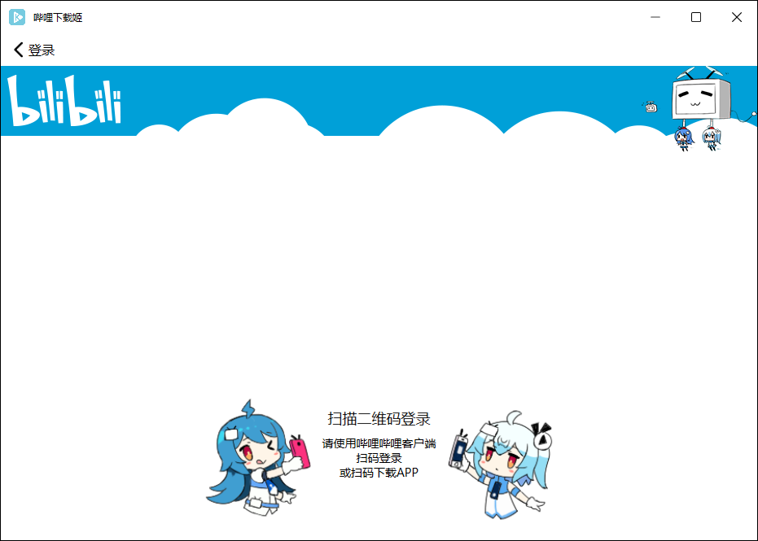
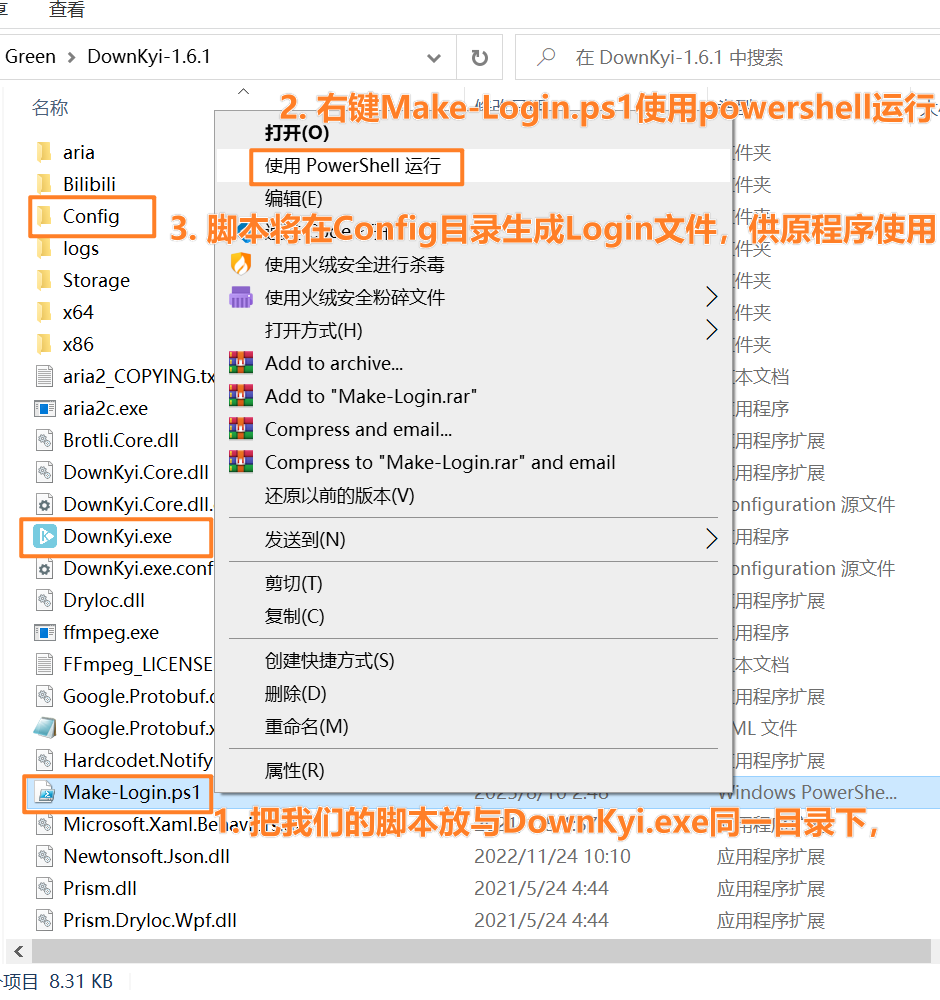
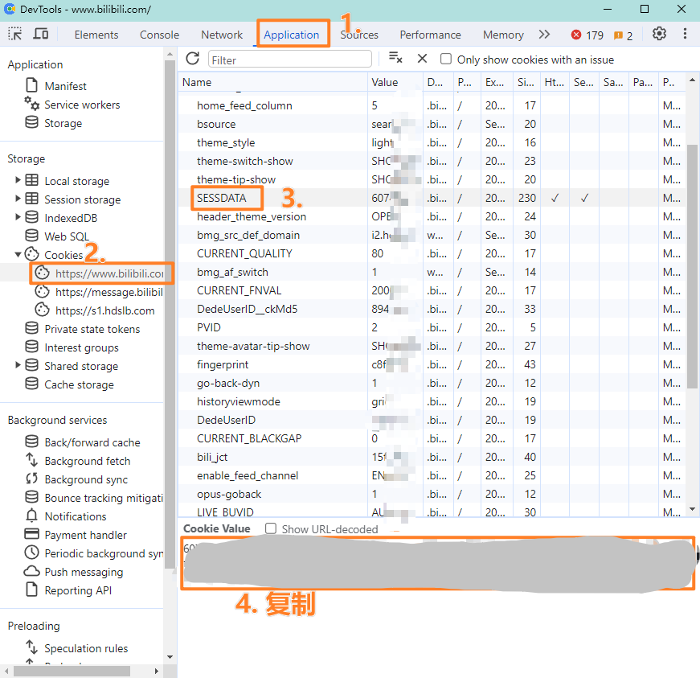
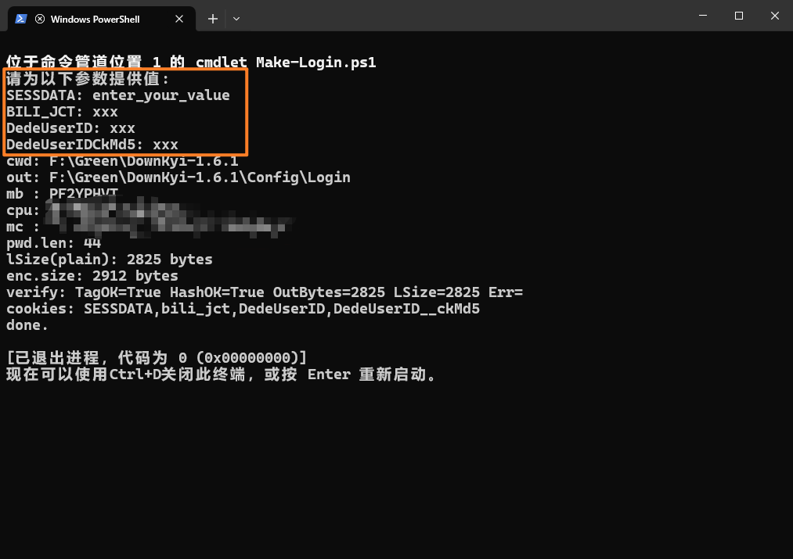

# downkyi-script

## 介绍

由于哔哩哔哩接口变化，原[downkyi v1.6.x](https://github.com/leiurayer/downkyi/tree/v1.6.x)已无法展示二维码

本人使用 cursor 分析了 downkyi 登录状态读写/本地持久化的逻辑，编写了适用于 Windows 的 powershell 脚本`downkyi-script`，帮助你在不改变原有软件的情况下轻松完成登录。

## 使用方法

1. 下载本项目的Make-Login.ps1，放到图中目录，右键选择powershell运行

2. 打开已登录的哔哩哔哩网页端https://www.bilibili.com/ ，按下F12打开浏览器调试工具，切换到Application页

   

3. 在左侧找到Cookies，选择`https://www.bilibili.com/` ，在右侧依次找到并复制SESSDATA，BILI_JCT，DedeUserID，DedeUserIDCkMd5的值，填入刚才打开的脚本窗口

   
   
4. 脚本成功执行后将在`.\DownKyi-1.6.1\Config\`目录生成`Login`文件，再打开原`DownKyi.exe`即可获得登录状态
   
   ## 参考
   
   [获取SESSDATA](https://github.com/BilibiliVideoDownload/BilibiliVideoDownload/wiki/%E8%8E%B7%E5%8F%96SESSDATA)
   
   [PowerShell：因为在此系统上禁止运行脚本，解决方法](https://syxdevcode.github.io/2021/09/04/PowerShell%EF%BC%9A%E5%9B%A0%E4%B8%BA%E5%9C%A8%E6%AD%A4%E7%B3%BB%E7%BB%9F%E4%B8%8A%E7%A6%81%E6%AD%A2%E8%BF%90%E8%A1%8C%E8%84%9A%E6%9C%AC%EF%BC%8C%E8%A7%A3%E5%86%B3%E6%96%B9%E6%B3%95/)